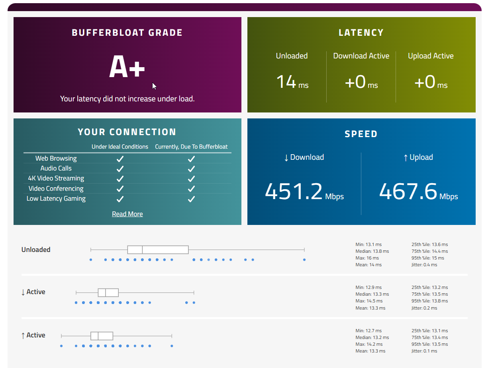

# 📡🕵️‍♂️ Raspberry-Ci5: The Net Correctional 📊🛰️

> ###### **Status:** `Functional` 🌱 (Class A Operational)

------

> [!NOTE]
>
> # 🛸💨 **The Proof** 🟰 **The** 🍰
>
> ### Pi 5 Cortex-A76 achieving **+0ms Latency** & **0.2ms Jitter** under full load.
>
> 
>
> **This is not "good" for a home router. It is statistically perfect.**
>
> ###### (Test: 500/500Mbps Fiber via R7800 AP | Active: Suricata IDS + CrowdSec + CAKE)
> ------
> ### **[Bufferbloat Result (+ direct download for /docs/.csv)](https://www.waveform.com/tools/bufferbloat?test-id=bb0dc946-bb4e-4b63-a2e5-72f47f80040e)**
------

### 📉 **The "Why" (Market Correction)** 📈

Most routers are **Tier 1 Garbage** (ISP/Consumer) or **Tier 3 Overkill** ($600+ Enterprise/Vendor-Locked).

Ci5 proves that commodity ARM hardware + open-source software can mechanically outperform proprietary appliances costing 4x as much.

| **Model**             | **Price (£)** | **Latency / Jitter** | **IDS Throughput** |       **Architecture**       |  **Freedom?**  |
| --------------------- | :------------ | :------------------: | :----------------: | :--------------------------: | :------------: |
| **Pi5 OpenWrt (Ci5)** | **£130**      |  **✅ +0ms / 0.2ms**  |   **~920 Mbps**    | **Hybrid (Kernel + Docker)** | **🔓 Absolute** |
| Ubiquiti UDM-SE       | £480          |     ⚠️ +3ms / 2ms     |      3.5 Gbps      |          Monolithic          | 🔒 Vendor Lock  |
| Firewalla Gold+       | £580+         |     ✅ +1ms / 1ms     |      2.5 Gbps      |      Proprietary Linux       | 🔒 Proprietary  |
| GL.iNet Flint 2       | £130          |     ✅ +2ms / 3ms     |     ~500 Mbps      |         OpenWrt Fork         | 🔓 Open Source  |
| UniFi Gateway Ultra   | £105          |   ⚠️ +10ms (SmartQ)   |       1 Gbps       |          Monolithic          | 🔒 Vendor Lock  |

------

## 💾 Phase 1: <u>Firmware Generation</u> 🃏

##### We utilize a custom "Golden Master" OpenWrt image. This pre-bakes the kernel drivers, file systems, and tools needed to run Docker on bare metal.

**CRITICAL: Use the EXT4 image. SquashFS is read-only and will brick this workflow.**

- ⚙️ **Direct Download (Recommended)**

  - ###### Pre-compiled **Factory (EXT4)** image with the Ci5 package set.

  - **[🔗 DOWNLOAD (openwrt-24.10.4-ext4-factory.img.gz)](https://sysupgrade.openwrt.org/store/7766ba8cd22b62ab32c4c4085844ca2cabe30cf054858693a997c9cce152cef3/openwrt-24.10.4-5557c802b251-bcm27xx-bcm2712-rpi-5-ext4-factory.img.gz)**

------

- 🛠️ **Alternative: Build it Yourself** (*Trust Issues Edition*)

  - ###### Go to **[firmware-selector.openwrt.org](https://firmware-selector.openwrt.org/)** -> **Raspberry Pi 5**.

  - ###### Click '**Customize installed packages**' and paste the block below.

  - ###### **Request Build** -> Download **FACTORY (EXT4)**.

<details>
<summary>📦 <b>Click to expand Package List</b></summary>

```text
adguardhome base-files bcm27xx-gpu-fw bcm27xx-utils bind-dig bind-libs block-mount brcmfmac-firmware-usb brcmfmac-nvram-43455-sdio btrfs-progs busybox ca-bundle ca-certificates cgi-io curl cypress-firmware-43455-sdio dbus dnsmasq dropbear e2fsprogs ethtool fdisk firewall4 fstools fwtool getrandom hostapd-common htop ip-full ip-tiny ip6tables-zz-legacy iptables-mod-conntrack-extra iptables-mod-extra iptables-mod-ipopt iptables-nft iptables-zz-legacy iw iwinfo jansson4 jq jshn jsonfilter kernel kmod-br-netfilter kmod-brcmfmac kmod-brcmutil kmod-cfg80211 kmod-crypto-acompress kmod-crypto-blake2b kmod-crypto-crc32c kmod-crypto-hash kmod-crypto-kpp kmod-crypto-lib-chacha20 kmod-crypto-lib-chacha20poly1305 kmod-crypto-lib-curve25519 kmod-crypto-lib-poly1305 kmod-crypto-sha256 kmod-crypto-xxhash kmod-fs-btrfs kmod-fs-exfat kmod-fs-ext4 kmod-fs-ntfs3 kmod-fs-vfat kmod-hid kmod-hid-generic kmod-hwmon-core kmod-hwmon-pwmfan kmod-i2c-bcm2835 kmod-i2c-brcmstb kmod-i2c-core kmod-i2c-designware-core kmod-i2c-designware-platform kmod-ifb kmod-input-core kmod-input-evdev kmod-ip6tables kmod-ipt-conntrack kmod-ipt-conntrack-extra kmod-ipt-core kmod-ipt-extra kmod-ipt-ipopt kmod-ipt-nat kmod-ipt-nat6 kmod-ipt-physdev kmod-lib-crc-ccitt kmod-lib-crc16 kmod-lib-crc32c kmod-lib-lzo kmod-lib-raid6 kmod-lib-xor kmod-lib-xxhash kmod-lib-zlib-deflate kmod-lib-zlib-inflate kmod-lib-zstd kmod-libphy kmod-mdio-devres kmod-mii kmod-mmc kmod-net-selftests kmod-nf-conncount kmod-nf-conntrack kmod-nf-conntrack6 kmod-nf-flow kmod-nf-ipt kmod-nf-ipt6 kmod-nf-log kmod-nf-log6 kmod-nf-nat kmod-nf-nat6 kmod-nf-reject kmod-nf-reject6 kmod-nfnetlink kmod-nfnetlink-queue kmod-nft-bridge kmod-nft-compat kmod-nft-core kmod-nft-fib kmod-nft-nat kmod-nft-offload kmod-nft-queue kmod-nls-base kmod-nls-cp437 kmod-nls-iso8859-1 kmod-nls-utf8 kmod-phy-ax88796b kmod-phylink kmod-ppp kmod-pppoe kmod-pppox kmod-regmap-core kmod-sched-cake kmod-sched-core kmod-scsi-core kmod-slhc kmod-spi-bcm2835 kmod-spi-dw kmod-spi-dw-mmio kmod-tcp-bbr kmod-thermal kmod-tun kmod-udptunnel4 kmod-udptunnel6 kmod-usb-core kmod-usb-hid kmod-usb-net kmod-usb-net-asix kmod-usb-net-asix-ax88179 kmod-usb-net-cdc-ether kmod-usb-net-cdc-ncm kmod-usb-net-rtl8152 kmod-usb-storage kmod-usb-storage-uas kmod-veth libatomic1 libattr libblkid1 libblobmsg-json20240329 libbpf1 libc libcap libcbor0 libcomerr0 libcurl4 libdaemon libdbus libe2p2 libelf1 libevdev libevent2-7 libexpat libext2fs2 libf2fs6 libfdisk1 libfdt libfido2-1 libgcc1 libip4tc2 libip6tc2 libiptext-nft0 libiptext0 libiptext6-0 libiwinfo-data libiwinfo20230701 libjson-c5 libjson-script20240329 liblua5.1.5 liblucihttp-lua liblucihttp-ucode liblucihttp0 liblzo2 libmbedtls21 libmnl0 libmount1 libncurses6 libnftnl11 libnghttp2-14 libnl-tiny1 libopenssl3 libparted libpcap1 libpthread libreadline8 librt libseccomp libsmartcols1 libss2 libubox20240329 libubus-lua libubus20250102 libuci20250120 libuclient20201210 libucode20230711 libudebug libudev-zero libunbound liburcu libusb-1.0-0 libustream-mbedtls20201210 libuuid1 libuv1 libwebsockets-full libxtables12 logd losetup lua luci luci-app-firewall luci-app-package-manager luci-app-sqm luci-app-unbound luci-base luci-compat luci-lib-base luci-lib-ip luci-lib-jsonc luci-lib-nixio luci-lib-uqr luci-light luci-lua-runtime luci-mod-admin-full luci-mod-network luci-mod-status luci-mod-system luci-proto-ipv6 luci-proto-ppp luci-theme-bootstrap mkf2fs mtd netifd nftables-json odhcp6c odhcpd-ipv6only openwrt-keyring opkg parted partx-utils ppp ppp-mod-pppoe procd procd-seccomp procd-ujail r8152-firmware resize2fs resolveip rpcd rpcd-mod-file rpcd-mod-iwinfo rpcd-mod-luci rpcd-mod-rrdns rpcd-mod-ucode sqm-scripts tc-tiny tcpdump terminfo ubox ubus ubusd uci uclient-fetch ucode ucode-mod-fs ucode-mod-html ucode-mod-lua ucode-mod-math ucode-mod-nl80211 ucode-mod-rtnl ucode-mod-ubus ucode-mod-uci ucode-mod-uloop uhttpd uhttpd-mod-ubus unbound-control unbound-daemon urandom-seed usbids usbutils usign wifi-scripts wireless-regdb wpad-basic-mbedtls xtables-legacy xtables-nft zlib
```
</details>

------

## 🛒 Phase 2: **<u>Hardware Essentials</u>** 👨‍🔧

> 🧠 **The Brain (Compute)**

| **Component**                    | **Rationale**                                                | **Note**                                                     |
| -------------------------------- | ------------------------------------------------------------ | ------------------------------------------------------------ |
| **🤖 Raspberry Pi 5 (4GB / 8GB)** | Cortex-A76 is required for line-rate DPI/SQM. Pi 4 cannot do this. | 8GB mandatory for **Full Stack**.                            |
| **⚡ USB-C PD PSU (27W+)**        | Stability is non-negotiable. Packet processing spikes power. | Official PSU recommended.                                    |
| **💾 Storage**                    | **Lite:** MicroSD (A1/A2) is fine. **Full:** USB 3.0 Flash/SSD required. | Logs and Docker I/O will kill SD cards.                      |
| **🔌 USB 3.0 NIC (WAN)**          | Dedicated lane for Internet ingress. Leaves onboard ETH for LAN. | Yes, USB 3.0 works. The latency overhead is negligible vs CAKE gains. |
| **🛜 Access Point**               | Pi 5 onboard Wi-Fi is garbage. Use a dedicated AP.           | Tested with Netgear R7800 (OpenWrt) & UniFi.                 |

------

## 🛡️ Phase 3: **<u>The Architecture</u>** ⚔️

We use a **Hybrid Control Plane** approach.

- **Kernel Space (Metal):** Handles the "Fast Path": **Routing, NAT, CAKE SQM, and DNS.** This ensures 0ms latency.
- **User Space (Docker):** Handles the "Smart Path": **IDS, Threat Intel, Analytics.** Isolated to prevent router crashes.

## 1. **The Core (Lite)** 🌐🧱

**The "Set and Forget" Router**

- **Stack:** Native OpenWrt + AdGuard Home + Unbound + CAKE SQM.
- **Performance:** Max throughput, lowest latency. Zero bloat.
- **Target:** Gaming, households, people who just want the internet to work perfectly.

> [!IMPORTANT]
>
> - [ ] **Run this first! Even if you want the Full stack, this lays the foundation**:

```
sh install-lite.sh
```

## 2. The Stack (Full) 🚨🔍

**The "Fortress"**

- **Stack:** Adds Suricata (IDS), CrowdSec (IPS), Ntopng (Vis), Redis.
- **Capabilities:** Deep Packet Inspection, IP ban-lists, Layer-7 Analysis.
- **Cost:** Uses ~1.8GB RAM. Requires 4GB+ Pi.

> [!IMPORTANT]
>
> - [ ] **Reboot after Lite install, then run**:

```
sh install-full.sh
```

------

> [!TIP]
>
> ```
> "Fuck all this Dream Machine dick-measuring contest. We all gon be dead in 100 years.
> Let the kids have the unmaintained Raspberry-Ci5 auto-install scripts w/ Docker, NIDs & 0ms lag"
> ```
>
> ------
> ###### > 🌪️ **UDM Pro Funnel:** 🎪  jape.eth 🃏
